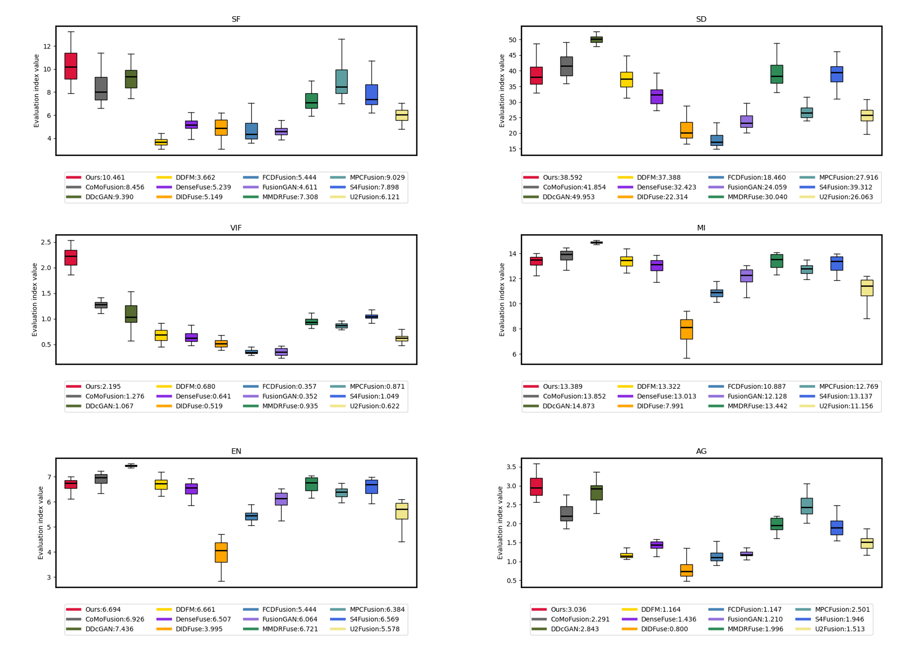

# A detail preservation fusion framework for infrared-visible images via Bayesian and MDLatLRR
### We sincerely appreciate your interest and support. The README will be further improved after acceptance.
## 1. Progect Overview
Despite advancements in image fusion methods, existing techniques often fail to effectively preserve high-resolution details, especially in complex images. In this paper, we propose a novel method based on Bayesian pre-fusion and multi-scale transformations to address this challenge and enhance detail preservation.The method first uses a Bayesian-based pre-fusion technique to create a pre-fused image, preserving the main structure and information, providing a solid foundation for subsequent steps. Next, infrared and visible images are decomposed with the Multi-layer Decomposition Latent Low-Rank Representation (MDLatLRR) method to extract the base layers, which are fused using a multi-level optimal fusion algorithm. MDLatLRR aims to maximize key information retention by decomposing low-rank features and detail layers. Then, using the pre-fused image, a visible light factor derived from the Structural Similarity Index (SSIM) is introduced in an L2-norm optimization to generate the final detail fusion layer. SSIM ensures structural similarity, preserving critical details and minimizing fusion errors. Finally, inverse transformations are applied to the fused base and detail layers to obtain the final fused image. Experimental results validate the effectiveness of our method, demonstrating superior performance in high-resolution detail preservation and edge contour clarity compared to 11 state-of-the-art fusion methods across four public datasets.
## 2. Framework

## 3. Environment Setup
### Sofware Dependencies
MATLAB Version: Ensure you have MATLAB installed. We recommend version R2018b or higher.
### Hardware Requirements
 2.30 GHZ l(R) Core (TM) i7–12700 H CPU with 16.00 GB RAM.
## 4. Installation and Usage
### Clone the repository
```bash
git clone https://github.com/YangZhengrun/A-detail-preservation-fusion-framework for-infrared-visible-images-via-Bayesian-and-MDLatLRR.git
cd A-detail-preservation-fusion-framework for-infrared-visible-images-via-Bayesian-and-MDLatLRR
```

#### Usage：
* Place the dataset in the input folder.
* Run the test.m script to process the data.
* The fused results will be saved in the output folder.

## 5. Key Algorithms and Implementation
First, we apply a Bayesian fusion technique to obtain a pre-fused image. The baselayer of the final fused image is obtained by decomposing both infrared and visible images using MDLatLRR, followed by a multi-level optimal fusion algorithm. The details of the final fused image layer are obtained by using the pre-fused image as a reference. The Structural Similarity Index (SSIM) is introduced to evaluate the effectiveness of the visible image’s detail information . This information is then converted into a visible light adjustment factor, which is applied in an L2-norm based optimization method to generate the final detail fusion layer. Finally, inverse transformations are applied to process the fused base and detail layers to obtain the final fused image.

## 6. Datasets and Experiments 

#### Datasets 
* The TNO dataset can be downloaded at the following address: [https://figshare.com/articles/dataset/TNO_Image_Fusion_Dataset/1008029](https://figshare.com/articles/dataset/TNO_Image_Fusion_Dataset/1008029)
* The Roadscene dataset can be downloaded at the following address: [https://github.com/jiayi-ma/RoadScene](https://github.com/jiayi-ma/RoadScene)
* The LLVIP dataset can be downloaded at the following address: https://bupt-ai-cz.github.io/LLVIP/
* The M3FD dataset can be downloaded at the following address:https://universe.roboflow.com/rgbi/m3fd-tlj7u

### Experiments 



## 7. Citation
#### If you use this project's code,please cite our paper:
```bibtex
@article{xxx_2025_ME-PMA,
  title={Enhanced Infrared and Visible Image Fusion via Latent Low-Rank and Coupled Feature Learning},
  author={xxx},
  journal={xxx},
  volume={xx},
  number={x},
  pages={x--x},
  year={2025}
}
```
## 8. Contact Information
- **Email**: 1254773719@qq.com or chengfangzhang@scpolicec.edu.cn
